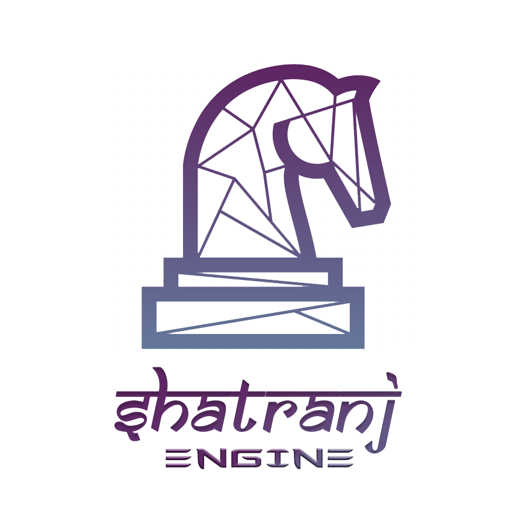
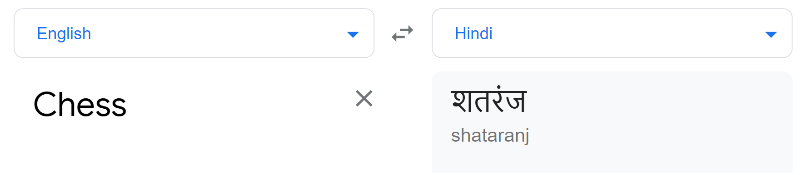

[](https://opensource.org/licenses/Apache-2.0)

[](https://travis-ci.com/thisIsShubhamSharma/s_engine)

<!-- PROJECT LOGO -->
<br />
<p align="center">
  <a href="https://github.com/thisIsShubhamSharma/s_engine">
    

    
  </a>

  <h1 align="center">s_engine - Shatranj_Engine</h1>

  <h2 align="center">
    A chess engine made with python. 
    <br />
  </h2>
  <br />
  <br />
  <br />
  
</p>


### Runing the pygame version 
<br />

1. Clone the repo 
```sh
git clone https://github.com/thisIsShubhamSharma/s_engine
```

2. Install requirements
```sh
pip3 install -r requirements.txt
```

3. Start the engine
```sh
python3 chess_main.py
```


### TODO
1. improve the UI
2. improve the readme
3. fix bugs
4. rewrite in C++ or RUST


